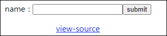
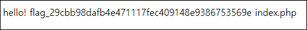
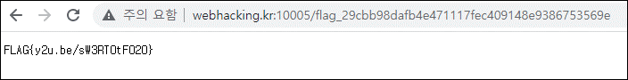
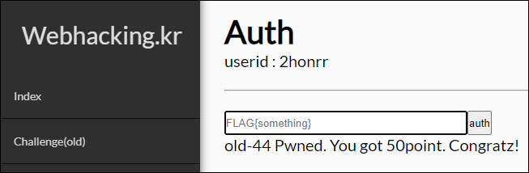

# [목차]
**1. [Description](#Description)**

**2. [Write-Up](#Write-Up)**

**3. [FLAG](#FLAG)**


***


# **Description**




# **Write-Up**

view-source를 클릭하면 입력한 값의 5글자까지 자르고 system 의 변수로 들어간다.

```php
... 생략 ...
<?php
  if($_POST['id']){
    $id = $_POST['id'];
    $id = substr($id,0,5);
    system("echo 'hello! {$id}'"); // You just need to execute ls
  }
?>
... 생략 ...
```

' 을 닫고 ; 으로 이어서 ls를 실행시켜주고 '를 다시 닫아주자.



그리고 flag로 보이는 파일에 접근하자.



FLAG를 인증하여 점수를 획득하자.



웬 커버곡 영상이 나온다. 의도가 뭔지 모르겠다.


# **FLAG**

**FLAG{y2u.be/sW3RT0tF020}**