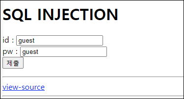
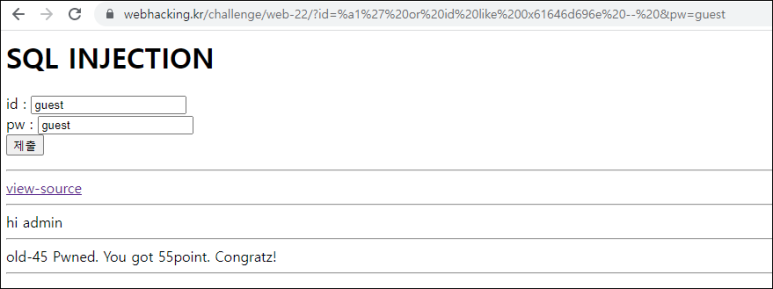

# [목차]
**1. [Description](#Description)**

**2. [Write-Up](#Write-Up)**


***


# **Description**




# **Write-Up**

view-source를 보면 id와 pw에 작은 따옴표, 큰 따옴표, 백 슬래쉬, 널 바이트가 포함되어 있다면, 앞에 백 슬래쉬를 추가하고 인코딩 타입은 utf-8에서 euc-kr로 변경한다.

```php
... 생략 ...
<?php
  if($_GET['id'] && $_GET['pw']){
    $db = dbconnect();
    $_GET['id'] = addslashes($_GET['id']);
    $_GET['pw'] = addslashes($_GET['pw']);
    $_GET['id'] = mb_convert_encoding($_GET['id'],'utf-8','euc-kr');
    if(preg_match("/admin|select|limit|pw|=|<|>/i",$_GET['id'])) exit();
    if(preg_match("/admin|select|limit|pw|=|<|>/i",$_GET['pw'])) exit();
    $result = mysqli_fetch_array(mysqli_query($db,"select id from chall45 where id='{$_GET['id']}' and pw=md5('{$_GET['pw']}')"));
    if($result){
      echo "hi {$result['id']}";
      if($result['id'] == "admin") solve(45);
    }
    else echo("Wrong");
  }
?>
... 생략 ...
```

이때, mb_convert_encoding을 적용할 데이터에 %a1 ~ %fe + 백슬래쉬 데이터가 있다면 다른 데이터로 치환된다는 취약점이 존재한다.

따라서, id에 %a1' or id like 0x61646d696e를 넘겨주면 id가 admin인 id를 select하게된다.

