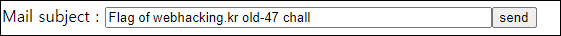

# [목차]
**1. [Description](#Description)**

**2. [Write-Up](#Write-Up)**

**3. [FLAG](#FLAG)**

***

# **Description**

# **Write-Up**

send를 클릭하면 메일이 전송되었다고 한다.

* 운영자분 피셜 서비스를 위한 비용을 지불하지 않아서 이후 풀 수 없다고 한다.

# **FLAG**

**FLAG{...}**