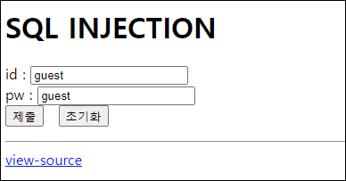
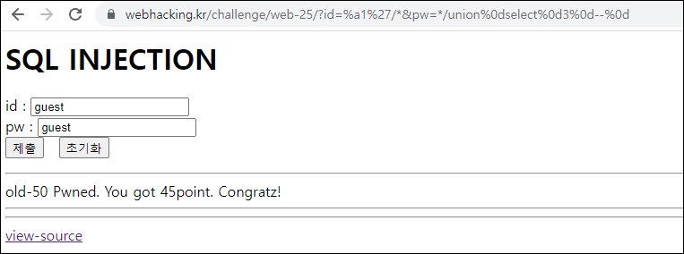

# [목차]
**1. [Description](#Description)**

**2. [Write-Up](#Write-Up)**


***


# **Description**




# **Write-Up**

view-source를 보면 mb_convert_encoding 이후에 필터링이 늘었다.

```php
... 생략 ...
<?php
  if($_GET['id'] && $_GET['pw']){
    $db = dbconnect();
    $_GET['id'] = addslashes($_GET['id']); 
    $_GET['pw'] = addslashes($_GET['pw']);
    $_GET['id'] = mb_convert_encoding($_GET['id'],'utf-8','euc-kr');
    foreach($_GET as $ck) if(preg_match("/from|pw|\(|\)| |%|=|>|</i",$ck)) exit();
    if(preg_match("/union/i",$_GET['id'])) exit();
    $result = mysqli_fetch_array(mysqli_query($db,"select lv from chall50 where id='{$_GET['id']}' and pw=md5('{$_GET['pw']}')"));
    if($result){
      if($result['lv']==1) echo("level : 1<br><br>");
      if($result['lv']==2) echo("level : 2<br><br>");
    } 
    if($result['lv']=="3") solve(50);
    if(!$result) echo("Wrong");
  }
?>
... 생략 ...
```

old 45번 처럼하면 풀리지는 않지면 여기서 사용했던 mb_convert_encoding  취약점을 활용하자.

우선 id에는 %a1'/*을 넣어서 select되는 것이 없게 하면서 md5함수를 무력화하고, pw에는 union필터링이 되지 않기 때문에 */ union select 3 -- 을 넣어서 lv이 3이 되게 만들자.

