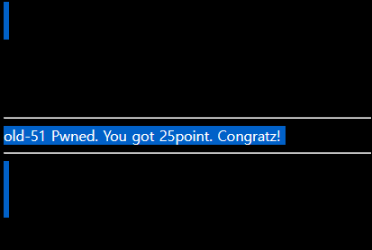

# [목차]
**1. [Description](#Description)**

**2. [Write-Up](#Write-Up)**


***


# **Description**


# **Write-Up**

우측의 view-source를 보면 id는 addslashes로 몇개의 문자를 필터링하고 pw는 md5 해쉬 값을 뜬다.

```php
... 생략 ...
<?php
  if($_POST['id'] && $_POST['pw']){
    $db = dbconnect();
    $input_id = addslashes($_POST['id']);
    $input_pw = md5($_POST['pw'],true);
    $result = mysqli_fetch_array(mysqli_query($db,"select id from chall51 where id='{$input_id}' and pw='{$input_pw}'"));
    if($result['id']) solve(51);
    if(!$result['id']) echo "<center><font color=green><h1>Wrong</h1></font></center>";
  }
?>
... 생략 ...
```

이때, md5의 2번째 인자 값이 true이면, 리턴 값이 스트링이 아니라 바이너리이다.

> [PHP MD5](https://www.php.net/manual/en/function.md5.php)

즉 md5의 결과가 바이너리 상으로 ' or 어쩌구가 나오면 된다.

> [SQLi with raw MD5](https://cvk.posthaven.com/sql-injection-with-raw-md5-hashes)

id에 아무 값을 넣고, pw에 129581926211651571912466741651878684928을 넣어서 id에 값을 채워주자.

