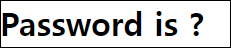
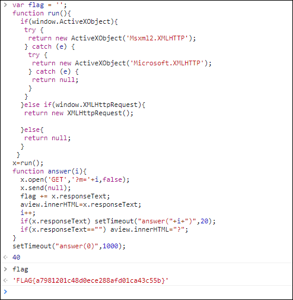
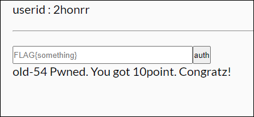

# [목차]
**1. [Description](#Description)**

**2. [Write-Up](#Write-Up)**

**3. [FLAG](#FLAG)**


***


# **Description**




# **Write-Up**

뭔가 휘리릭 지나간다. javascript를 확인하자.

```javascript
function run(){
  if(window.ActiveXObject){
   try {
    return new ActiveXObject('Msxml2.XMLHTTP');
   } catch (e) {
    try {
     return new ActiveXObject('Microsoft.XMLHTTP');
    } catch (e) {
     return null;
    }
   }
  }else if(window.XMLHttpRequest){
   return new XMLHttpRequest();
 
  }else{
   return null;
  }
 }
x=run();
function answer(i){
  x.open('GET','?m='+i,false);
  x.send(null);
  aview.innerHTML=x.responseText;
  i++;
  if(x.responseText) setTimeout("answer("+i+")",20);
  if(x.responseText=="") aview.innerHTML="?";
}
setTimeout("answer(0)",1000);
```

0.02초마다 텍스트가 바뀌기 때문에 인지하는 건 쉽지않으니 변수를 하나 두어 기록하자.



FLAG를 인증하여 점수를 획득하자.




# **FLAG**

**FLAG{a7981201c48d0ece288afd01ca43c55b}**