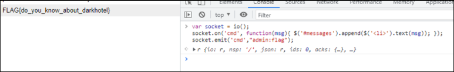

# [목차]
**1. [Description](#Description)**

**2. [Write-Up](#Write-Up)**

**3. [FLAG](#FLAG)**


***


# **Description**


# **Write-Up**

javascript 소스를 보면 socket io를 이용하여 메세지를 주고받는다.

```javascript
    $(function () {
      var username = "guest";
      var socket = io();
      $('form').submit(function(e){
        e.preventDefault();
        socket.emit('cmd',username+":"+$('#m').val());
        $('#m').val('');
        return false;
      });
      socket.on('cmd', function(msg){
        $('#messages').append($('<li>').text(msg));
      });
    });
```

다수의 명령어는 찾을 수 없다고 하고, help를 치니 사용할 수 있는 명령어가 나왔다.

    ls id flag help

flag를 치니 admin만 사용가능하다고 나온다.

    permission denied... admin only!

chrome 개발자 도구를 이용하여 username을 admin으로 바꾸어 입력하자.



FLAG를 인증하여 점수를 획득하자.


# **FLAG**

**FLAG{do_you_know_about_darkhotel}**