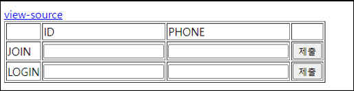
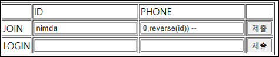
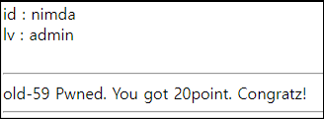

# [목차]
**1. [Description](#Description)**

**2. [Write-Up](#Write-Up)**


***


# **Description**




# **Write-Up**

view-source를 클릭하면 addslashes가 들어가 SQLi를 사용할 만한 곳은 phone밖에 없고 20글자를 넘어가면 안된다.

```php
<?php
  include "../../config.php";
  if($_GET['view_source']) view_source();
  $db = dbconnect();
  if($_POST['lid'] && isset($_POST['lphone'])){
    $_POST['lid'] = addslashes($_POST['lid']);
    $_POST['lphone'] = addslashes($_POST['lphone']);
    $result = mysqli_fetch_array(mysqli_query($db,"select id,lv from chall59 where id='{$_POST['lid']}' and phone='{$_POST['lphone']}'"));
    if($result['id']){
      echo "id : {$result['id']}<br>lv : {$result['lv']}<br><br>";
      if($result['lv'] == "admin"){
      mysqli_query($db,"delete from chall59");
      solve(59);
    }
    echo "<br><a href=./?view_source=1>view-source</a>";
    exit();
    }
  }
  if($_POST['id'] && isset($_POST['phone'])){
    $_POST['id'] = addslashes($_POST['id']);
    $_POST['phone'] = addslashes($_POST['phone']);
    if(strlen($_POST['phone'])>=20) exit("Access Denied");
    if(preg_match("/admin/i",$_POST['id'])) exit("Access Denied");
    if(preg_match("/admin|0x|#|hex|char|ascii|ord|select/i",$_POST['phone'])) exit("Access Denied");
    mysqli_query($db,"insert into chall59 values('{$_POST['id']}',{$_POST['phone']},'guest')");
  }
?>
... 생략 ...
```

admin과 hex는 필터링되고, 바이너리를 사용하면 20글자를 넘어가게 될 것이다. 따라서 reverse함수를 사용하자.



그리고 가입한 ID와 PHONE을 입력하여 로그인하자.


점수를 획득하자.

