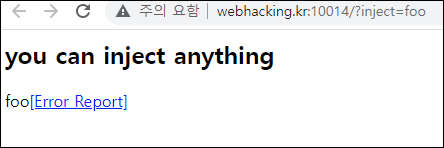
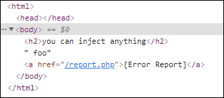
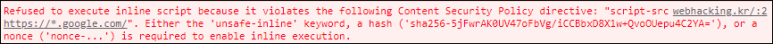
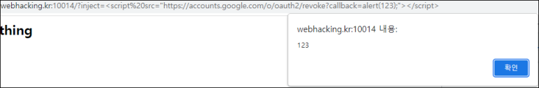
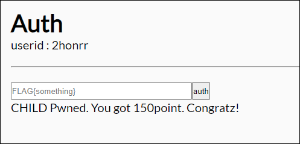

# [목차]
**1. [Description](#Description)**

**2. [Write-Up](#Write-Up)**

**3. [FLAG](#FLAG)**

***

# **Description**

# **Write-Up**

BABY문제와 유사한 문제이다.

하지만 script.js를 상대경로를 통해 로드하는 것이 아닌 존재하지 않다.

https://*.google.com이라는 키워드가 있다.

https://accounts.google.com/o/oauth2/revoke 를 이용하여 XSS를 시도할 수 있다.

report.php에서 문자열과 변수를 합치기 위한 +기호를 URL encoding을 두번 해야한다는 점을 유의하여 다음을 넘기면 FLAG값을 확인할 수 있다.

    ?inject=

FLAG를 인증하여 점수를 획득하자.

# **FLAG**

**FLAG{I_hacked_google.com_and_it_was_ezpz}**