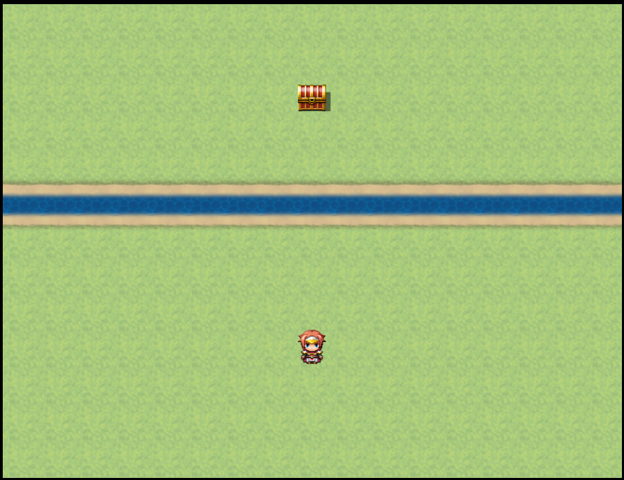
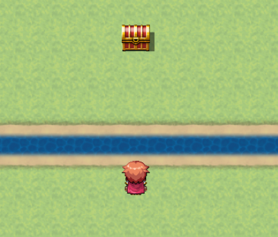
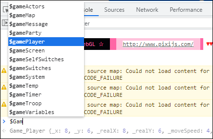
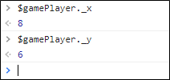
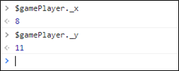
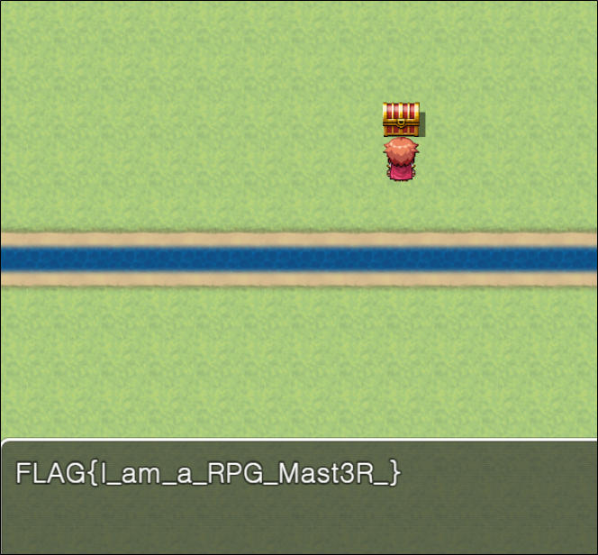
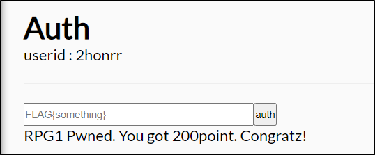

# [목차]
**1. [Description](#Description)**

**2. [Write-Up](#Write-Up)**

**3. [FLAG](#FLAG)**

***

# **Description**

# **Write-Up**

중간에 존재하는 물? 강? 때문에 보물상자로 접근이 불가능 하다.

개발자 도구를 이용하여 전역변수에 접근이 가능한지 살펴보자.

그 중 gamePlayer 변수의 _x, _y값을 보면 8,6이라는 점을 알 수 있다.

캐릭터를 이동한 뒤 _x, _y값을 검증해보자. 현재 좌우에는 변화를 주지 않고, 상하의 움직임만 주었다.

_x, _y가 캐릭터의 위치가 맞으니 값을 넣어서 보물상자의 위치로 가서 FLAG를 획득하자.

FLAG를 인증하여 점수를 획득하자.

> [여기서 단서를 얻었다. ](https://biud436.tistory.com/98)

# **FLAG**

**FLAG{I_am_a_RPG_Mast3R_}**