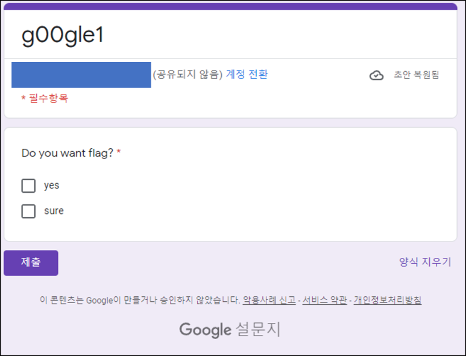
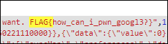
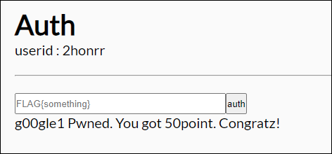

# [목차]
**1. [Description](#Description)**

**2. [Write-Up](#Write-Up)**

**3. [FLAG](#FLAG)**

***

# **Description**

# **Write-Up**

체크 박스를 클릭하면 최소 0개를 선택하라고 하고, 선택안하면 필수항목이라 막힌다.

다만 script상에서 FLAG가 존재한다.

FLAG를 인증하여 점수를 획득하자.

# **FLAG**

**FLAG{how_can_i_pwn_googl3?}**