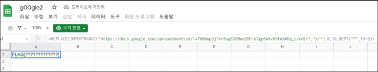
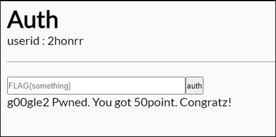

# [목차]
**1. [Description](#Description)**

**2. [Write-Up](#Write-Up)**

**3. [FLAG](#FLAG)**

***

# **Description**

# **Write-Up**

참조되는 스프레드 시트의 A1에 원본 FLAG가 존재하고, 6번째 자리부터 19글자까지 ?로 치환한다.

원본 스프레드 시트에 접근하려고 하면 엑세스가 거부된다.

Burp Suite로 중간 패킷들을 잡아보자. Target을 설정하고,

Request와 Response 둘 다 FLAG 혹은 flag라는 값이 들어있으면 잡게 필터링 걸어주자.

Edge에서 접근하면 FLAG 혹은 flag라는 문자열이 들어간 패킷이 잡히고, 다음과 같이 진짜 FLAG가 들어있는 패킷을 발견할 수 있다.

쿠키 값을 달고 참조되는 시트에 접근하여서 데이터를 받아온 뒤 REPLACE 처리하는 것 같다.

FLAG를 인증하여 점수를 획득하자.

# **FLAG**

**FLAG{now_i_pwned_googl3?}**